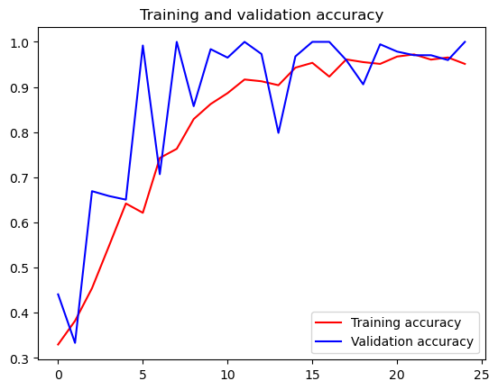

```python
!pip install tflite-model-maker
```

    Collecting tflite-model-maker
      Using cached tflite_model_maker-0.4.3-py3-none-any.whl (580 kB)
    Collecting matplotlib<3.5.0,>=3.0.3
      Using cached matplotlib-3.4.3-cp39-cp39-win_amd64.whl (7.1 MB)
    Collecting tensorflow-addons>=0.11.2
      Using cached tensorflow_addons-0.22.0-cp39-cp39-win_amd64.whl (729 kB)
    Requirement already satisfied: lxml>=4.6.1 in c:\users\22599\anaconda3\lib\site-packages (from tflite-model-maker) (4.9.1)
    Requirement already satisfied: tensorflow-hub<0.13,>=0.7.0 in c:\users\22599\anaconda3\lib\site-packages (from tflite-model-maker) (0.12.0)
    Collecting flatbuffers>=2.0
      Using cached flatbuffers-25.2.10-py2.py3-none-any.whl (30 kB)
    Collecting fire>=0.3.1
      Using cached fire-0.7.0-py3-none-any.whl
    Requirement already satisfied: sentencepiece>=0.1.91 in c:\users\22599\anaconda3\lib\site-packages (from tflite-model-maker) (0.2.0)
    Collecting tensorflow-model-optimization>=0.5
      Using cached tensorflow_model_optimization-0.8.0-py2.py3-none-any.whl (242 kB)
    Collecting tensorflow>=2.6.0
      Using cached tensorflow-2.19.0-cp39-cp39-win_amd64.whl (375.7 MB)
    Requirement already satisfied: PyYAML>=5.1 in c:\users\22599\anaconda3\lib\site-packages (from tflite-model-maker) (6.0)
    Requirement already satisfied: Cython>=0.29.13 in c:\users\22599\anaconda3\lib\site-packages (from tflite-model-maker) (0.29.32)
    Collecting absl-py>=0.10.0
      Using cached absl_py-2.2.2-py3-none-any.whl (135 kB)
    Collecting neural-structured-learning>=1.3.1
      Using cached neural_structured_learning-1.4.0-py2.py3-none-any.whl (128 kB)
    Requirement already satisfied: pillow>=7.0.0 in c:\users\22599\anaconda3\lib\site-packages (from tflite-model-maker) (9.2.0)
    Collecting tensorflow-datasets>=2.1.0
      Using cached tensorflow_datasets-4.9.3-py3-none-any.whl (5.0 MB)
    Collecting tf-models-official==2.3.0
      Using cached tf_models_official-2.3.0-py2.py3-none-any.whl (840 kB)
    Collecting librosa==0.8.1
      Using cached librosa-0.8.1-py3-none-any.whl (203 kB)
    Collecting tensorflowjs<3.19.0,>=2.4.0
      Using cached tensorflowjs-3.18.0-py3-none-any.whl (77 kB)
    Collecting tflite-support>=0.4.2
      Using cached tflite_support-0.4.3-cp39-cp39-win_amd64.whl (469 kB)
    Requirement already satisfied: numba>=0.53 in c:\users\22599\anaconda3\lib\site-packages (from tflite-model-maker) (0.55.1)
    Requirement already satisfied: six>=1.12.0 in c:\users\22599\anaconda3\lib\site-packages (from tflite-model-maker) (1.16.0)
    Requirement already satisfied: urllib3!=1.25.0,!=1.25.1,<1.26,>=1.21.1 in c:\users\22599\anaconda3\lib\site-packages (from tflite-model-maker) (1.25.11)
    Collecting numpy<1.23.4,>=1.17.3
      Using cached numpy-1.23.3-cp39-cp39-win_amd64.whl (14.7 MB)
    Collecting tflite-model-maker
      Using cached tflite_model_maker-0.4.2-py3-none-any.whl (577 kB)
    Collecting numba==0.53
      Using cached numba-0.53.0-cp39-cp39-win_amd64.whl (2.3 MB)
    Requirement already satisfied: numpy>=1.17.3 in c:\users\22599\anaconda3\lib\site-packages (from tflite-model-maker) (1.24.4)
    Collecting tflite-model-maker
      Using cached tflite_model_maker-0.4.1-py3-none-any.whl (642 kB)
      Using cached tflite_model_maker-0.4.0-py3-none-any.whl (642 kB)
    Requirement already satisfied: flatbuffers==1.12 in c:\users\22599\anaconda3\lib\site-packages (from tflite-model-maker) (1.12)
    Collecting tensorflowjs>=2.4.0
      Using cached tensorflowjs-4.22.0-py3-none-any.whl (89 kB)
    Collecting tflite-model-maker
      Using cached tflite_model_maker-0.3.4-py3-none-any.whl (616 kB)
    Requirement already satisfied: scipy>=1.0.0 in c:\users\22599\anaconda3\lib\site-packages (from librosa==0.8.1->tflite-model-maker) (1.9.1)
    Requirement already satisfied: packaging>=20.0 in c:\users\22599\anaconda3\lib\site-packages (from librosa==0.8.1->tflite-model-maker) (20.9)
    Collecting pooch>=1.0
      Using cached pooch-1.8.2-py3-none-any.whl (64 kB)
    Collecting resampy>=0.2.2
      Using cached resampy-0.4.3-py3-none-any.whl (3.1 MB)
    Collecting audioread>=2.0.0
      Using cached audioread-3.0.1-py3-none-any.whl (23 kB)
    Requirement already satisfied: decorator>=3.0.0 in c:\users\22599\anaconda3\lib\site-packages (from librosa==0.8.1->tflite-model-maker) (5.1.1)
    Collecting soundfile>=0.10.2
      Using cached soundfile-0.13.1-py2.py3-none-win_amd64.whl (1.0 MB)
    Requirement already satisfied: scikit-learn!=0.19.0,>=0.14.0 in c:\users\22599\anaconda3\lib\site-packages (from librosa==0.8.1->tflite-model-maker) (1.0.2)
    Requirement already satisfied: joblib>=0.14 in c:\users\22599\anaconda3\lib\site-packages (from librosa==0.8.1->tflite-model-maker) (1.1.0)
    Collecting llvmlite<0.37,>=0.36.0rc1
      Using cached llvmlite-0.36.0-cp39-cp39-win_amd64.whl (16.0 MB)
    Requirement already satisfied: setuptools in c:\users\22599\anaconda3\lib\site-packages (from numba==0.53->tflite-model-maker) (63.4.1)
    Requirement already satisfied: dataclasses in c:\users\22599\anaconda3\lib\site-packages (from tf-models-official==2.3.0->tflite-model-maker) (0.6)
    Requirement already satisfied: opencv-python-headless in c:\users\22599\anaconda3\lib\site-packages (from tf-models-official==2.3.0->tflite-model-maker) (4.11.0.86)
    Collecting google-api-python-client>=1.6.7
      Using cached google_api_python_client-2.169.0-py3-none-any.whl (13.3 MB)
    Collecting kaggle>=1.3.9
      Using cached kaggle-1.7.4.5-py3-none-any.whl (181 kB)
    Requirement already satisfied: psutil>=5.4.3 in c:\users\22599\anaconda3\lib\site-packages (from tf-models-official==2.3.0->tflite-model-maker) (5.9.0)
    Requirement already satisfied: gin-config in c:\users\22599\anaconda3\lib\site-packages (from tf-models-official==2.3.0->tflite-model-maker) (0.5.0)
    Collecting tf-slim>=1.1.0
      Using cached tf_slim-1.1.0-py2.py3-none-any.whl (352 kB)
    Requirement already satisfied: pandas>=0.22.0 in c:\users\22599\anaconda3\lib\site-packages (from tf-models-official==2.3.0->tflite-model-maker) (1.4.4)
    Collecting google-cloud-bigquery>=0.31.0
      Using cached google_cloud_bigquery-3.33.0-py3-none-any.whl (253 kB)
    Requirement already satisfied: py-cpuinfo>=3.3.0 in c:\users\22599\anaconda3\lib\site-packages (from tf-models-official==2.3.0->tflite-model-maker) (9.0.0)
    Requirement already satisfied: termcolor in c:\users\22599\anaconda3\lib\site-packages (from fire>=0.3.1->tflite-model-maker) (3.1.0)
    Requirement already satisfied: kiwisolver>=1.0.1 in c:\users\22599\anaconda3\lib\site-packages (from matplotlib<3.5.0,>=3.0.3->tflite-model-maker) (1.4.2)
    Requirement already satisfied: pyparsing>=2.2.1 in c:\users\22599\anaconda3\lib\site-packages (from matplotlib<3.5.0,>=3.0.3->tflite-model-maker) (3.0.9)
    Requirement already satisfied: cycler>=0.10 in c:\users\22599\anaconda3\lib\site-packages (from matplotlib<3.5.0,>=3.0.3->tflite-model-maker) (0.11.0)
    Requirement already satisfied: python-dateutil>=2.7 in c:\users\22599\anaconda3\lib\site-packages (from matplotlib<3.5.0,>=3.0.3->tflite-model-maker) (2.8.2)
    Requirement already satisfied: attrs in c:\users\22599\anaconda3\lib\site-packages (from neural-structured-learning>=1.3.1->tflite-model-maker) (21.4.0)
    Collecting tensorflow>=2.6.0
      Using cached tensorflow-2.18.1-cp39-cp39-win_amd64.whl (369.0 MB)
      Using cached tensorflow-2.18.0-cp39-cp39-win_amd64.whl (7.5 kB)
    Collecting tensorflow-intel==2.18.0
      Using cached tensorflow_intel-2.18.0-cp39-cp39-win_amd64.whl (390.0 MB)
    INFO: pip is looking at multiple versions of tensorflow to determine which version is compatible with other requirements. This could take a while.
    Collecting tensorflow>=2.6.0
      Using cached tensorflow-2.17.1-cp39-cp39-win_amd64.whl (7.5 kB)
    Collecting tensorflow-intel==2.17.1
      Using cached tensorflow_intel-2.17.1-cp39-cp39-win_amd64.whl (382.2 MB)
    Collecting tensorflow>=2.6.0
      Using cached tensorflow-2.17.0-cp39-cp39-win_amd64.whl (2.0 kB)
    Collecting tensorflow-intel==2.17.0
      Using cached tensorflow_intel-2.17.0-cp39-cp39-win_amd64.whl (385.0 MB)
    Collecting tensorflow>=2.6.0
      Using cached tensorflow-2.16.2-cp39-cp39-win_amd64.whl (2.1 kB)
    Collecting tensorflow-intel==2.16.2
      Using cached tensorflow_intel-2.16.2-cp39-cp39-win_amd64.whl (376.9 MB)
    Collecting tensorflow>=2.6.0
      Using cached tensorflow-2.16.1-cp39-cp39-win_amd64.whl (2.1 kB)
    Collecting tensorflow-intel==2.16.1
      Using cached tensorflow_intel-2.16.1-cp39-cp39-win_amd64.whl (376.9 MB)
    Collecting tensorflow>=2.6.0
      Using cached tensorflow-2.15.1-cp39-cp39-win_amd64.whl (2.1 kB)
    Collecting tensorflow-intel==2.15.1
      Using cached tensorflow_intel-2.15.1-cp39-cp39-win_amd64.whl (300.8 MB)
    Collecting tensorflow>=2.6.0
      Using cached tensorflow-2.15.0-cp39-cp39-win_amd64.whl (2.1 kB)
    Collecting tensorflow-intel==2.15.0
      Using cached tensorflow_intel-2.15.0-cp39-cp39-win_amd64.whl (300.8 MB)
    Collecting tensorflow>=2.6.0
      Using cached tensorflow-2.14.1-cp39-cp39-win_amd64.whl (2.1 kB)
    Collecting tensorflow-intel==2.14.1
      Using cached tensorflow_intel-2.14.1-cp39-cp39-win_amd64.whl (284.1 MB)
    INFO: pip is looking at multiple versions of tensorflow to determine which version is compatible with other requirements. This could take a while.
    Collecting tensorflow>=2.6.0
      Using cached tensorflow-2.14.0-cp39-cp39-win_amd64.whl (2.1 kB)
    Collecting tensorflow-intel==2.14.0
      Using cached tensorflow_intel-2.14.0-cp39-cp39-win_amd64.whl (284.1 MB)
    Collecting tensorflow>=2.6.0
      Using cached tensorflow-2.13.1-cp39-cp39-win_amd64.whl (1.9 kB)
    Collecting tensorflow-intel==2.13.1
      Using cached tensorflow_intel-2.13.1-cp39-cp39-win_amd64.whl (276.5 MB)
    Requirement already satisfied: typing-extensions<4.6.0,>=3.6.6 in c:\users\22599\anaconda3\lib\site-packages (from tensorflow-intel==2.13.1->tensorflow>=2.6.0->tflite-model-maker) (4.3.0)
    Requirement already satisfied: wrapt>=1.11.0 in c:\users\22599\anaconda3\lib\site-packages (from tensorflow-intel==2.13.1->tensorflow>=2.6.0->tflite-model-maker) (1.14.1)
    Requirement already satisfied: libclang>=13.0.0 in c:\users\22599\anaconda3\lib\site-packages (from tensorflow-intel==2.13.1->tensorflow>=2.6.0->tflite-model-maker) (18.1.1)
    Requirement already satisfied: h5py>=2.9.0 in c:\users\22599\anaconda3\lib\site-packages (from tensorflow-intel==2.13.1->tensorflow>=2.6.0->tflite-model-maker) (3.7.0)
    Requirement already satisfied: opt-einsum>=2.3.2 in c:\users\22599\anaconda3\lib\site-packages (from tensorflow-intel==2.13.1->tensorflow>=2.6.0->tflite-model-maker) (3.4.0)
    Requirement already satisfied: tensorflow-io-gcs-filesystem>=0.23.1 in c:\users\22599\anaconda3\lib\site-packages (from tensorflow-intel==2.13.1->tensorflow>=2.6.0->tflite-model-maker) (0.31.0)
    Collecting protobuf!=4.21.0,!=4.21.1,!=4.21.2,!=4.21.3,!=4.21.4,!=4.21.5,<5.0.0dev,>=3.20.3
      Using cached protobuf-4.25.7-cp39-cp39-win_amd64.whl (413 kB)
    Collecting tensorflow>=2.6.0
      Using cached tensorflow-2.13.0-cp39-cp39-win_amd64.whl (1.9 kB)
    Collecting tensorflow-intel==2.13.0
      Using cached tensorflow_intel-2.13.0-cp39-cp39-win_amd64.whl (276.5 MB)
    Collecting tensorflow>=2.6.0
      Using cached tensorflow-2.12.1-cp39-cp39-win_amd64.whl (1.9 kB)
    Collecting tensorflow-intel==2.12.1
      Using cached tensorflow_intel-2.12.1-cp39-cp39-win_amd64.whl (272.8 MB)
    Collecting tensorboard<2.13,>=2.12
      Using cached tensorboard-2.12.3-py3-none-any.whl (5.6 MB)
    Collecting keras<2.13,>=2.12.0
      Using cached keras-2.12.0-py2.py3-none-any.whl (1.7 MB)
    Collecting tensorflow>=2.6.0
      Using cached tensorflow-2.12.0-cp39-cp39-win_amd64.whl (1.9 kB)
    Collecting tensorflow-intel==2.12.0
      Using cached tensorflow_intel-2.12.0-cp39-cp39-win_amd64.whl (272.8 MB)
    INFO: This is taking longer than usual. You might need to provide the dependency resolver with stricter constraints to reduce runtime. See https://pip.pypa.io/warnings/backtracking for guidance. If you want to abort this run, press Ctrl + C.
    Collecting tensorflow>=2.6.0
      Using cached tensorflow-2.11.1-cp39-cp39-win_amd64.whl (1.9 kB)
    Collecting tensorflow-intel==2.11.1
      Using cached tensorflow_intel-2.11.1-cp39-cp39-win_amd64.whl (266.3 MB)
    Collecting tensorflow>=2.6.0
      Using cached tensorflow-2.11.0-cp39-cp39-win_amd64.whl (1.9 kB)
    Collecting tensorflow-intel==2.11.0
      Using cached tensorflow_intel-2.11.0-cp39-cp39-win_amd64.whl (266.3 MB)
    Collecting tensorflow>=2.6.0
      Using cached tensorflow-2.10.1-cp39-cp39-win_amd64.whl (455.9 MB)
    Collecting keras<2.11,>=2.10.0
      Using cached keras-2.10.0-py2.py3-none-any.whl (1.7 MB)
    Collecting tensorflow-estimator<2.11,>=2.10.0
      Using cached tensorflow_estimator-2.10.0-py2.py3-none-any.whl (438 kB)
    Collecting keras-preprocessing>=1.1.1
      Using cached Keras_Preprocessing-1.1.2-py2.py3-none-any.whl (42 kB)
    Collecting tensorflow>=2.6.0
      Using cached tensorflow-2.10.0-cp39-cp39-win_amd64.whl (455.9 MB)
      Using cached tensorflow-2.9.3-cp39-cp39-win_amd64.whl (444.1 MB)
    Collecting tensorboard<2.10,>=2.9
      Using cached tensorboard-2.9.1-py3-none-any.whl (5.8 MB)
    Requirement already satisfied: keras<2.10.0,>=2.9.0rc0 in c:\users\22599\anaconda3\lib\site-packages (from tensorflow>=2.6.0->tflite-model-maker) (2.9.0)
    Requirement already satisfied: protobuf<3.20,>=3.9.2 in c:\users\22599\anaconda3\lib\site-packages (from tensorflow>=2.6.0->tflite-model-maker) (3.19.6)
    Collecting gast<=0.4.0,>=0.2.1
      Using cached gast-0.4.0-py3-none-any.whl (9.8 kB)
    Requirement already satisfied: tensorflow-estimator<2.10.0,>=2.9.0rc0 in c:\users\22599\anaconda3\lib\site-packages (from tensorflow>=2.6.0->tflite-model-maker) (2.9.0)
    Collecting astunparse>=1.6.0
      Using cached astunparse-1.6.3-py2.py3-none-any.whl (12 kB)
    Collecting google-pasta>=0.1.1
      Using cached google_pasta-0.2.0-py3-none-any.whl (57 kB)
    Collecting grpcio<2.0,>=1.24.3
      Using cached grpcio-1.71.0-cp39-cp39-win_amd64.whl (4.3 MB)
    Requirement already satisfied: typeguard<3.0.0,>=2.7 in c:\users\22599\anaconda3\lib\site-packages (from tensorflow-addons>=0.11.2->tflite-model-maker) (2.13.3)
    Requirement already satisfied: toml in c:\users\22599\anaconda3\lib\site-packages (from tensorflow-datasets>=2.1.0->tflite-model-maker) (0.10.2)
    Collecting etils[enp,epath,etree]>=0.9.0
      Using cached etils-1.5.2-py3-none-any.whl (140 kB)
    Requirement already satisfied: requests>=2.19.0 in c:\users\22599\anaconda3\lib\site-packages (from tensorflow-datasets>=2.1.0->tflite-model-maker) (2.28.1)
    Requirement already satisfied: dm-tree in c:\users\22599\anaconda3\lib\site-packages (from tensorflow-datasets>=2.1.0->tflite-model-maker) (0.1.8)
    Requirement already satisfied: tqdm in c:\users\22599\anaconda3\lib\site-packages (from tensorflow-datasets>=2.1.0->tflite-model-maker) (4.64.1)
    Collecting tensorflow-metadata
      Using cached tensorflow_metadata-1.17.1-py3-none-any.whl (31 kB)
    Requirement already satisfied: click in c:\users\22599\anaconda3\lib\site-packages (from tensorflow-datasets>=2.1.0->tflite-model-maker) (8.0.4)
    Requirement already satisfied: promise in c:\users\22599\anaconda3\lib\site-packages (from tensorflow-datasets>=2.1.0->tflite-model-maker) (2.3)
    Collecting tensorflow-datasets>=2.1.0
      Using cached tensorflow_datasets-4.9.2-py3-none-any.whl (5.4 MB)
      Using cached tensorflow_datasets-4.9.1-py3-none-any.whl (5.4 MB)
      Using cached tensorflow_datasets-4.9.0-py3-none-any.whl (5.4 MB)
    Collecting array-record
      Using cached array_record-0.4.1-py39-none-any.whl (3.0 MB)
    Collecting absl-py>=0.10.0
      Using cached absl_py-1.4.0-py3-none-any.whl (126 kB)
    Collecting importlib_resources>=5.9.0
      Using cached importlib_resources-6.5.2-py3-none-any.whl (37 kB)
    Collecting tensorflow-decision-forests>=1.5.0
      Using cached tensorflow_decision_forests-1.8.1.tar.gz (15.2 MB)
      Preparing metadata (setup.py): started
      Preparing metadata (setup.py): finished with status 'done'
    Collecting tf-keras>=2.13.0
      Using cached tf_keras-2.19.0-py3-none-any.whl (1.7 MB)
    Collecting packaging>=20.0
      Using cached packaging-23.2-py3-none-any.whl (53 kB)
    Collecting flax>=0.7.2
      Using cached flax-0.8.5-py3-none-any.whl (731 kB)
    Collecting tensorflowjs>=2.4.0
      Using cached tensorflowjs-4.21.0-py3-none-any.whl (89 kB)
      Using cached tensorflowjs-4.20.0-py3-none-any.whl (89 kB)
      Using cached tensorflowjs-4.19.0-py3-none-any.whl (89 kB)
      Using cached tensorflowjs-4.18.0-py3-none-any.whl (89 kB)
      Using cached tensorflowjs-4.17.0-py3-none-any.whl (89 kB)
      Using cached tensorflowjs-4.16.0-py3-none-any.whl (89 kB)
      Using cached tensorflowjs-4.15.0-py3-none-any.whl (89 kB)
      Using cached tensorflowjs-4.14.0-py3-none-any.whl (89 kB)
      Using cached tensorflowjs-4.13.0-py3-none-any.whl (89 kB)
      Using cached tensorflowjs-4.12.0-py3-none-any.whl (89 kB)
      Using cached tensorflowjs-4.11.0-py3-none-any.whl (89 kB)
      Using cached tensorflowjs-4.10.0-py3-none-any.whl (89 kB)
      Using cached tensorflowjs-4.9.0-py3-none-any.whl (89 kB)
      Using cached tensorflowjs-4.8.0-py3-none-any.whl (85 kB)
      Using cached tensorflowjs-4.7.0-py3-none-any.whl (85 kB)
      Using cached tensorflowjs-4.6.0-py3-none-any.whl (85 kB)
      Using cached tensorflowjs-4.5.0-py3-none-any.whl (85 kB)
      Using cached tensorflowjs-4.4.0-py3-none-any.whl (85 kB)
    Collecting jax>=0.3.16
      Using cached jax-0.4.30-py3-none-any.whl (2.0 MB)
    INFO: pip is looking at multiple versions of tensorflowjs to determine which version is compatible with other requirements. This could take a while.
    Collecting tensorflowjs>=2.4.0
      Using cached tensorflowjs-4.3.0-py3-none-any.whl (85 kB)
      Using cached tensorflowjs-4.2.0-py3-none-any.whl (84 kB)
      Using cached tensorflowjs-4.1.0-py3-none-any.whl (84 kB)
      Using cached tensorflowjs-4.0.0-py3-none-any.whl (83 kB)
      Using cached tensorflowjs-3.21.0-py3-none-any.whl (81 kB)
    Collecting sounddevice>=0.4.4
      Using cached sounddevice-0.5.2-py3-none-win_amd64.whl (363 kB)
    Requirement already satisfied: pybind11>=2.6.0 in c:\users\22599\anaconda3\lib\site-packages (from tflite-support>=0.4.2->tflite-model-maker) (2.13.6)
    Collecting tflite-support>=0.3.1
      Using cached tflite_support-0.4.2-cp39-cp39-win_amd64.whl (454 kB)
      Using cached tflite_support-0.4.1-cp39-cp39-win_amd64.whl (439 kB)
    Requirement already satisfied: wheel<1.0,>=0.23.0 in c:\users\22599\anaconda3\lib\site-packages (from astunparse>=1.6.0->tensorflow>=2.6.0->tflite-model-maker) (0.37.1)
    Requirement already satisfied: fsspec in c:\users\22599\anaconda3\lib\site-packages (from etils[enp,epath,etree]>=0.9.0->tensorflow-datasets>=2.1.0->tflite-model-maker) (2022.7.1)
    Requirement already satisfied: zipp in c:\users\22599\anaconda3\lib\site-packages (from etils[enp,epath,etree]>=0.9.0->tensorflow-datasets>=2.1.0->tflite-model-maker) (3.8.0)
    Collecting optax
      Using cached optax-0.2.4-py3-none-any.whl (319 kB)
    Collecting orbax-checkpoint
      Using cached orbax_checkpoint-0.6.4-py3-none-any.whl (270 kB)
    Collecting tensorstore
      Using cached tensorstore-0.1.69-cp39-cp39-win_amd64.whl (12.0 MB)
    Requirement already satisfied: msgpack in c:\users\22599\anaconda3\lib\site-packages (from flax>=0.7.2->tensorflowjs>=2.4.0->tflite-model-maker) (1.0.3)
    Collecting rich>=11.1
      Using cached rich-14.0.0-py3-none-any.whl (243 kB)
    Collecting google-auth-httplib2<1.0.0,>=0.2.0
      Using cached google_auth_httplib2-0.2.0-py2.py3-none-any.whl (9.3 kB)
    Collecting google-api-core!=2.0.*,!=2.1.*,!=2.2.*,!=2.3.0,<3.0.0,>=1.31.5
      Using cached google_api_core-2.24.2-py3-none-any.whl (160 kB)
    Collecting httplib2<1.0.0,>=0.19.0
      Using cached httplib2-0.22.0-py3-none-any.whl (96 kB)
    Requirement already satisfied: uritemplate<5,>=3.0.1 in c:\users\22599\anaconda3\lib\site-packages (from google-api-python-client>=1.6.7->tf-models-official==2.3.0->tflite-model-maker) (4.1.1)
    Collecting google-auth!=2.24.0,!=2.25.0,<3.0.0,>=1.32.0
      Using cached google_auth-2.40.1-py2.py3-none-any.whl (216 kB)
    Collecting google-cloud-bigquery>=0.31.0
      Using cached google_cloud_bigquery-3.31.0-py3-none-any.whl (250 kB)
      Using cached google_cloud_bigquery-3.30.0-py2.py3-none-any.whl (247 kB)
    Collecting google-resumable-media<3.0dev,>=2.0.0
      Using cached google_resumable_media-2.7.2-py2.py3-none-any.whl (81 kB)
    Collecting google-cloud-core<3.0.0dev,>=2.4.1
      Using cached google_cloud_core-2.4.3-py2.py3-none-any.whl (29 kB)
    Collecting jaxlib<=0.4.30,>=0.4.27
      Using cached jaxlib-0.4.30-cp39-cp39-win_amd64.whl (51.9 MB)
    Requirement already satisfied: ml-dtypes>=0.2.0 in c:\users\22599\anaconda3\lib\site-packages (from jax>=0.3.16->tensorflowjs>=2.4.0->tflite-model-maker) (0.5.1)
    Requirement already satisfied: importlib-metadata>=4.6 in c:\users\22599\anaconda3\lib\site-packages (from jax>=0.3.16->tensorflowjs>=2.4.0->tflite-model-maker) (4.11.3)
    Requirement already satisfied: certifi>=14.05.14 in c:\users\22599\anaconda3\lib\site-packages (from kaggle>=1.3.9->tf-models-official==2.3.0->tflite-model-maker) (2022.9.14)
    Requirement already satisfied: text-unidecode in c:\users\22599\anaconda3\lib\site-packages (from kaggle>=1.3.9->tf-models-official==2.3.0->tflite-model-maker) (1.3)
    Requirement already satisfied: idna in c:\users\22599\anaconda3\lib\site-packages (from kaggle>=1.3.9->tf-models-official==2.3.0->tflite-model-maker) (3.3)
    Requirement already satisfied: charset-normalizer in c:\users\22599\anaconda3\lib\site-packages (from kaggle>=1.3.9->tf-models-official==2.3.0->tflite-model-maker) (2.0.4)
    Requirement already satisfied: python-slugify in c:\users\22599\anaconda3\lib\site-packages (from kaggle>=1.3.9->tf-models-official==2.3.0->tflite-model-maker) (5.0.2)
    Requirement already satisfied: webencodings in c:\users\22599\anaconda3\lib\site-packages (from kaggle>=1.3.9->tf-models-official==2.3.0->tflite-model-maker) (0.5.1)
    Requirement already satisfied: bleach in c:\users\22599\anaconda3\lib\site-packages (from kaggle>=1.3.9->tf-models-official==2.3.0->tflite-model-maker) (4.1.0)
    Requirement already satisfied: pytz>=2020.1 in c:\users\22599\anaconda3\lib\site-packages (from pandas>=0.22.0->tf-models-official==2.3.0->tflite-model-maker) (2022.1)
    Requirement already satisfied: platformdirs>=2.5.0 in c:\users\22599\anaconda3\lib\site-packages (from pooch>=1.0->librosa==0.8.1->tflite-model-maker) (2.5.2)
    Requirement already satisfied: threadpoolctl>=2.0.0 in c:\users\22599\anaconda3\lib\site-packages (from scikit-learn!=0.19.0,>=0.14.0->librosa==0.8.1->tflite-model-maker) (2.2.0)
    Requirement already satisfied: CFFI>=1.0 in c:\users\22599\anaconda3\lib\site-packages (from sounddevice>=0.4.4->tflite-support>=0.4.2->tflite-model-maker) (1.15.1)
    Collecting google-auth-oauthlib<0.5,>=0.4.1
      Using cached google_auth_oauthlib-0.4.6-py2.py3-none-any.whl (18 kB)
    Requirement already satisfied: tensorboard-data-server<0.7.0,>=0.6.0 in c:\users\22599\anaconda3\lib\site-packages (from tensorboard<2.10,>=2.9->tensorflow>=2.6.0->tflite-model-maker) (0.6.1)
    Requirement already satisfied: tensorboard-plugin-wit>=1.6.0 in c:\users\22599\anaconda3\lib\site-packages (from tensorboard<2.10,>=2.9->tensorflow>=2.6.0->tflite-model-maker) (1.8.1)
    Requirement already satisfied: werkzeug>=1.0.1 in c:\users\22599\anaconda3\lib\site-packages (from tensorboard<2.10,>=2.9->tensorflow>=2.6.0->tflite-model-maker) (2.0.3)
    Requirement already satisfied: markdown>=2.6.8 in c:\users\22599\anaconda3\lib\site-packages (from tensorboard<2.10,>=2.9->tensorflow>=2.6.0->tflite-model-maker) (3.3.4)
    Requirement already satisfied: colorama in c:\users\22599\anaconda3\lib\site-packages (from click->tensorflow-datasets>=2.1.0->tflite-model-maker) (0.4.5)
    Collecting tensorflow-metadata
      Using cached tensorflow_metadata-1.17.0-py3-none-any.whl (29 kB)
      Using cached tensorflow_metadata-1.16.1-py3-none-any.whl (28 kB)
      Using cached tensorflow_metadata-1.16.0-py3-none-any.whl (28 kB)
      Using cached tensorflow_metadata-1.15.0-py3-none-any.whl (28 kB)
      Using cached tensorflow_metadata-1.14.0-py3-none-any.whl (28 kB)
      Using cached tensorflow_metadata-1.13.1-py3-none-any.whl (28 kB)
    Collecting googleapis-common-protos<2,>=1.52.0
      Using cached googleapis_common_protos-1.70.0-py3-none-any.whl (294 kB)
    Collecting tensorflow-metadata
      Using cached tensorflow_metadata-1.13.0-py3-none-any.whl (53 kB)
    Requirement already satisfied: pycparser in c:\users\22599\anaconda3\lib\site-packages (from CFFI>=1.0->sounddevice>=0.4.4->tflite-support>=0.4.2->tflite-model-maker) (2.21)
    Requirement already satisfied: proto-plus<2.0.0,>=1.22.3 in c:\users\22599\anaconda3\lib\site-packages (from google-api-core!=2.0.*,!=2.1.*,!=2.2.*,!=2.3.0,<3.0.0,>=1.31.5->google-api-python-client>=1.6.7->tf-models-official==2.3.0->tflite-model-maker) (1.26.1)
    Collecting grpcio-status<2.0.dev0,>=1.33.2
      Using cached grpcio_status-1.71.0-py3-none-any.whl (14 kB)
    Requirement already satisfied: pyasn1-modules>=0.2.1 in c:\users\22599\anaconda3\lib\site-packages (from google-auth!=2.24.0,!=2.25.0,<3.0.0,>=1.32.0->google-api-python-client>=1.6.7->tf-models-official==2.3.0->tflite-model-maker) (0.2.8)
    Requirement already satisfied: rsa<5,>=3.1.4 in c:\users\22599\anaconda3\lib\site-packages (from google-auth!=2.24.0,!=2.25.0,<3.0.0,>=1.32.0->google-api-python-client>=1.6.7->tf-models-official==2.3.0->tflite-model-maker) (4.9.1)
    Collecting cachetools<6.0,>=2.0.0
      Using cached cachetools-5.5.2-py3-none-any.whl (10 kB)
    Collecting requests-oauthlib>=0.7.0
      Using cached requests_oauthlib-2.0.0-py2.py3-none-any.whl (24 kB)
    Collecting google-crc32c<2.0dev,>=1.0
      Using cached google_crc32c-1.7.1-cp39-cp39-win_amd64.whl (33 kB)
    Collecting googleapis-common-protos<2,>=1.52.0
      Using cached googleapis_common_protos-1.69.2-py3-none-any.whl (293 kB)
      Using cached googleapis_common_protos-1.69.1-py2.py3-none-any.whl (293 kB)
      Using cached googleapis_common_protos-1.69.0-py2.py3-none-any.whl (169 kB)
      Using cached googleapis_common_protos-1.68.0-py2.py3-none-any.whl (164 kB)
      Using cached googleapis_common_protos-1.67.0-py2.py3-none-any.whl (164 kB)
      Using cached googleapis_common_protos-1.66.0-py2.py3-none-any.whl (221 kB)
      Using cached googleapis_common_protos-1.65.0-py2.py3-none-any.whl (220 kB)
      Using cached googleapis_common_protos-1.64.0-py2.py3-none-any.whl (220 kB)
      Using cached googleapis_common_protos-1.63.2-py2.py3-none-any.whl (220 kB)
      Using cached googleapis_common_protos-1.63.1-py2.py3-none-any.whl (229 kB)
    Requirement already satisfied: markdown-it-py>=2.2.0 in c:\users\22599\anaconda3\lib\site-packages (from rich>=11.1->flax>=0.7.2->tensorflowjs>=2.4.0->tflite-model-maker) (3.0.0)
    Requirement already satisfied: pygments<3.0.0,>=2.13.0 in c:\users\22599\anaconda3\lib\site-packages (from rich>=11.1->flax>=0.7.2->tensorflowjs>=2.4.0->tflite-model-maker) (2.19.1)
    Collecting chex>=0.1.87
      Using cached chex-0.1.89-py3-none-any.whl (99 kB)
    Collecting humanize
      Using cached humanize-4.12.3-py3-none-any.whl (128 kB)
    Requirement already satisfied: nest_asyncio in c:\users\22599\anaconda3\lib\site-packages (from orbax-checkpoint->flax>=0.7.2->tensorflowjs>=2.4.0->tflite-model-maker) (1.5.5)
    Requirement already satisfied: toolz>=0.9.0 in c:\users\22599\anaconda3\lib\site-packages (from chex>=0.1.87->optax->flax>=0.7.2->tensorflowjs>=2.4.0->tflite-model-maker) (0.11.2)
    Collecting grpcio-status<2.0.dev0,>=1.33.2
      Using cached grpcio_status-1.70.0-py3-none-any.whl (14 kB)
      Using cached grpcio_status-1.69.0-py3-none-any.whl (14 kB)
      Using cached grpcio_status-1.68.1-py3-none-any.whl (14 kB)
      Using cached grpcio_status-1.68.0-py3-none-any.whl (14 kB)
      Using cached grpcio_status-1.67.1-py3-none-any.whl (14 kB)
      Using cached grpcio_status-1.67.0-py3-none-any.whl (14 kB)
      Using cached grpcio_status-1.66.2-py3-none-any.whl (14 kB)
      Using cached grpcio_status-1.66.1-py3-none-any.whl (14 kB)
      Using cached grpcio_status-1.66.0-py3-none-any.whl (14 kB)
      Using cached grpcio_status-1.65.5-py3-none-any.whl (14 kB)
      Using cached grpcio_status-1.65.4-py3-none-any.whl (14 kB)
      Using cached grpcio_status-1.65.2-py3-none-any.whl (14 kB)
      Using cached grpcio_status-1.65.1-py3-none-any.whl (14 kB)
      Using cached grpcio_status-1.64.3-py3-none-any.whl (14 kB)
      Using cached grpcio_status-1.64.1-py3-none-any.whl (14 kB)
      Using cached grpcio_status-1.64.0-py3-none-any.whl (14 kB)
      Using cached grpcio_status-1.63.2-py3-none-any.whl (14 kB)
      Using cached grpcio_status-1.63.0-py3-none-any.whl (14 kB)
      Using cached grpcio_status-1.62.3-py3-none-any.whl (14 kB)
      Using cached grpcio_status-1.62.2-py3-none-any.whl (14 kB)
      Using cached grpcio_status-1.62.1-py3-none-any.whl (14 kB)
      Using cached grpcio_status-1.62.0-py3-none-any.whl (14 kB)
      Using cached grpcio_status-1.61.3-py3-none-any.whl (14 kB)
      Using cached grpcio_status-1.60.2-py3-none-any.whl (14 kB)
      Using cached grpcio_status-1.60.1-py3-none-any.whl (14 kB)
      Using cached grpcio_status-1.60.0-py3-none-any.whl (14 kB)
      Using cached grpcio_status-1.59.5-py3-none-any.whl (14 kB)
      Using cached grpcio_status-1.59.3-py3-none-any.whl (14 kB)
      Using cached grpcio_status-1.59.2-py3-none-any.whl (14 kB)
      Using cached grpcio_status-1.59.0-py3-none-any.whl (14 kB)
      Using cached grpcio_status-1.58.3-py3-none-any.whl (14 kB)
      Using cached grpcio_status-1.58.0-py3-none-any.whl (14 kB)
      Using cached grpcio_status-1.57.0-py3-none-any.whl (5.1 kB)
      Using cached grpcio_status-1.56.2-py3-none-any.whl (5.1 kB)
      Using cached grpcio_status-1.56.0-py3-none-any.whl (5.1 kB)
      Using cached grpcio_status-1.55.3-py3-none-any.whl (5.1 kB)
      Using cached grpcio_status-1.54.3-py3-none-any.whl (5.1 kB)
      Using cached grpcio_status-1.54.2-py3-none-any.whl (5.1 kB)
      Using cached grpcio_status-1.54.0-py3-none-any.whl (5.1 kB)
      Using cached grpcio_status-1.53.2-py3-none-any.whl (5.1 kB)
      Using cached grpcio_status-1.53.1-py3-none-any.whl (5.1 kB)
      Using cached grpcio_status-1.53.0-py3-none-any.whl (5.1 kB)
      Using cached grpcio_status-1.51.3-py3-none-any.whl (5.1 kB)
      Using cached grpcio_status-1.51.1-py3-none-any.whl (5.1 kB)
      Using cached grpcio_status-1.50.0-py3-none-any.whl (14 kB)
      Using cached grpcio_status-1.49.1-py3-none-any.whl (14 kB)
      Using cached grpcio_status-1.48.2-py3-none-any.whl (14 kB)
    Requirement already satisfied: mdurl~=0.1 in c:\users\22599\anaconda3\lib\site-packages (from markdown-it-py>=2.2.0->rich>=11.1->flax>=0.7.2->tensorflowjs>=2.4.0->tflite-model-maker) (0.1.2)
    Requirement already satisfied: pyasn1<0.5.0,>=0.4.6 in c:\users\22599\anaconda3\lib\site-packages (from pyasn1-modules>=0.2.1->google-auth!=2.24.0,!=2.25.0,<3.0.0,>=1.32.0->google-api-python-client>=1.6.7->tf-models-official==2.3.0->tflite-model-maker) (0.4.8)
    Requirement already satisfied: oauthlib>=3.0.0 in c:\users\22599\anaconda3\lib\site-packages (from requests-oauthlib>=0.7.0->google-auth-oauthlib<0.5,>=0.4.1->tensorboard<2.10,>=2.9->tensorflow>=2.6.0->tflite-model-maker) (3.2.2)
    Installing collected packages: llvmlite, keras-preprocessing, importlib_resources, humanize, httplib2, grpcio, googleapis-common-protos, google-pasta, google-crc32c, gast, fire, etils, cachetools, audioread, astunparse, absl-py, tf-slim, tensorstore, tensorflow-model-optimization, tensorflow-metadata, tensorflow-addons, soundfile, sounddevice, rich, requests-oauthlib, pooch, numba, neural-structured-learning, matplotlib, jaxlib, grpcio-status, google-resumable-media, google-auth, tflite-support, resampy, kaggle, jax, google-auth-oauthlib, google-auth-httplib2, google-api-core, tensorboard, orbax-checkpoint, librosa, google-cloud-core, google-api-python-client, chex, array-record, tensorflow-datasets, tensorflow, optax, google-cloud-bigquery, tf-models-official, flax, tensorflowjs, tflite-model-maker
      Attempting uninstall: llvmlite
        Found existing installation: llvmlite 0.38.0
    

    ERROR: Cannot uninstall 'llvmlite'. It is a distutils installed project and thus we cannot accurately determine which files belong to it which would lead to only a partial uninstall.
    


```python
import os
import zipfile
rock_dir = os.path.join('C:/Users/22599/rps/rock')
paper_dir = os.path.join('C:/Users/22599/rps/paper')
scissors_dir = os.path.join('C:/Users/22599/rps/scissors')

print('total training rock images:', len(os.listdir(rock_dir)))
print('total training paper images:', len(os.listdir(paper_dir)))
print('total training scissors images:', len(os.listdir(scissors_dir)))

rock_files = os.listdir(rock_dir)
print(rock_files[:10])

paper_files = os.listdir(paper_dir)
print(paper_files[:10])

scissors_files = os.listdir(scissors_dir)
print(scissors_files[:10])

```

    total training rock images: 840
    total training paper images: 840
    total training scissors images: 840
    ['rock01-000.png', 'rock01-001.png', 'rock01-002.png', 'rock01-003.png', 'rock01-004.png', 'rock01-005.png', 'rock01-006.png', 'rock01-007.png', 'rock01-008.png', 'rock01-009.png']
    ['paper01-000.png', 'paper01-001.png', 'paper01-002.png', 'paper01-003.png', 'paper01-004.png', 'paper01-005.png', 'paper01-006.png', 'paper01-007.png', 'paper01-008.png', 'paper01-009.png']
    ['scissors01-000.png', 'scissors01-001.png', 'scissors01-002.png', 'scissors01-003.png', 'scissors01-004.png', 'scissors01-005.png', 'scissors01-006.png', 'scissors01-007.png', 'scissors01-008.png', 'scissors01-009.png']
    


```python
%matplotlib inline

import matplotlib.pyplot as plt
import matplotlib.image as mpimg

pic_index = 2

next_rock = [os.path.join(rock_dir, fname) 
                for fname in rock_files[pic_index-2:pic_index]]
next_paper = [os.path.join(paper_dir, fname) 
                for fname in paper_files[pic_index-2:pic_index]]
next_scissors = [os.path.join(scissors_dir, fname) 
                for fname in scissors_files[pic_index-2:pic_index]]

for i, img_path in enumerate(next_rock+next_paper+next_scissors):
  #print(img_path)
  img = mpimg.imread(img_path)
  plt.imshow(img)
  plt.axis('Off')
  plt.show()

```


    

    


    

    


    

    


    

    


    

    


    

    


```python
!pip install -U tensorflow==2.8.0 
!pip install tflite-model-maker
```

    Collecting tensorflow==2.8.0
      Downloading tensorflow-2.8.0-cp39-cp39-win_amd64.whl (438.0 MB)
         -------------------------------------- 438.0/438.0 MB 2.6 MB/s eta 0:00:00
    Requirement already satisfied: h5py>=2.9.0 in c:\users\22599\appdata\roaming\python\python39\site-packages (from tensorflow==2.8.0) (3.13.0)
    Requirement already satisfied: libclang>=9.0.1 in c:\users\22599\anaconda3\lib\site-packages (from tensorflow==2.8.0) (18.1.1)
    Requirement already satisfied: opt-einsum>=2.3.2 in c:\users\22599\anaconda3\lib\site-packages (from tensorflow==2.8.0) (3.4.0)
    Collecting keras-preprocessing>=1.1.1
      Using cached Keras_Preprocessing-1.1.2-py2.py3-none-any.whl (42 kB)
    Requirement already satisfied: six>=1.12.0 in c:\users\22599\anaconda3\lib\site-packages (from tensorflow==2.8.0) (1.16.0)
    Requirement already satisfied: wrapt>=1.11.0 in c:\users\22599\anaconda3\lib\site-packages (from tensorflow==2.8.0) (1.14.1)
    Requirement already satisfied: absl-py>=0.4.0 in c:\users\22599\appdata\roaming\python\python39\site-packages (from tensorflow==2.8.0) (2.2.2)
    Requirement already satisfied: flatbuffers>=1.12 in c:\users\22599\anaconda3\lib\site-packages (from tensorflow==2.8.0) (1.12)
    Requirement already satisfied: typing-extensions>=3.6.6 in c:\users\22599\anaconda3\lib\site-packages (from tensorflow==2.8.0) (4.13.2)
    Requirement already satisfied: setuptools in c:\users\22599\anaconda3\lib\site-packages (from tensorflow==2.8.0) (63.4.1)
    Collecting keras<2.9,>=2.8.0rc0
      Downloading keras-2.8.0-py2.py3-none-any.whl (1.4 MB)
         ---------------------------------------- 1.4/1.4 MB 4.0 MB/s eta 0:00:00
    Requirement already satisfied: grpcio<2.0,>=1.24.3 in c:\users\22599\appdata\roaming\python\python39\site-packages (from tensorflow==2.8.0) (1.71.0)
    Collecting tensorboard<2.9,>=2.8
      Downloading tensorboard-2.8.0-py3-none-any.whl (5.8 MB)
         ---------------------------------------- 5.8/5.8 MB 4.4 MB/s eta 0:00:00
    Requirement already satisfied: protobuf>=3.9.2 in c:\users\22599\anaconda3\lib\site-packages (from tensorflow==2.8.0) (3.19.6)
    Requirement already satisfied: tensorflow-io-gcs-filesystem>=0.23.1 in c:\users\22599\anaconda3\lib\site-packages (from tensorflow==2.8.0) (0.31.0)
    Requirement already satisfied: astunparse>=1.6.0 in c:\users\22599\appdata\roaming\python\python39\site-packages (from tensorflow==2.8.0) (1.6.3)
    Requirement already satisfied: termcolor>=1.1.0 in c:\users\22599\anaconda3\lib\site-packages (from tensorflow==2.8.0) (3.1.0)
    Requirement already satisfied: google-pasta>=0.1.1 in c:\users\22599\appdata\roaming\python\python39\site-packages (from tensorflow==2.8.0) (0.2.0)
    Collecting tf-estimator-nightly==2.8.0.dev2021122109
      Downloading tf_estimator_nightly-2.8.0.dev2021122109-py2.py3-none-any.whl (462 kB)
         -------------------------------------- 462.5/462.5 kB 5.8 MB/s eta 0:00:00
    Requirement already satisfied: gast>=0.2.1 in c:\users\22599\appdata\roaming\python\python39\site-packages (from tensorflow==2.8.0) (0.6.0)
    Requirement already satisfied: numpy>=1.20 in c:\users\22599\anaconda3\lib\site-packages (from tensorflow==2.8.0) (1.24.4)
    Requirement already satisfied: wheel<1.0,>=0.23.0 in c:\users\22599\anaconda3\lib\site-packages (from astunparse>=1.6.0->tensorflow==2.8.0) (0.37.1)
    Requirement already satisfied: tensorboard-plugin-wit>=1.6.0 in c:\users\22599\anaconda3\lib\site-packages (from tensorboard<2.9,>=2.8->tensorflow==2.8.0) (1.8.1)
    Requirement already satisfied: tensorboard-data-server<0.7.0,>=0.6.0 in c:\users\22599\anaconda3\lib\site-packages (from tensorboard<2.9,>=2.8->tensorflow==2.8.0) (0.6.1)
    Requirement already satisfied: markdown>=2.6.8 in c:\users\22599\anaconda3\lib\site-packages (from tensorboard<2.9,>=2.8->tensorflow==2.8.0) (3.3.4)
    Requirement already satisfied: requests<3,>=2.21.0 in c:\users\22599\anaconda3\lib\site-packages (from tensorboard<2.9,>=2.8->tensorflow==2.8.0) (2.28.1)
    Requirement already satisfied: werkzeug>=0.11.15 in c:\users\22599\anaconda3\lib\site-packages (from tensorboard<2.9,>=2.8->tensorflow==2.8.0) (2.0.3)
    Collecting google-auth-oauthlib<0.5,>=0.4.1
      Using cached google_auth_oauthlib-0.4.6-py2.py3-none-any.whl (18 kB)
    Collecting google-auth<3,>=1.6.3
      Using cached google_auth-2.40.1-py2.py3-none-any.whl (216 kB)
    Collecting cachetools<6.0,>=2.0.0
      Using cached cachetools-5.5.2-py3-none-any.whl (10 kB)
    Requirement already satisfied: pyasn1-modules>=0.2.1 in c:\users\22599\anaconda3\lib\site-packages (from google-auth<3,>=1.6.3->tensorboard<2.9,>=2.8->tensorflow==2.8.0) (0.2.8)
    Requirement already satisfied: rsa<5,>=3.1.4 in c:\users\22599\anaconda3\lib\site-packages (from google-auth<3,>=1.6.3->tensorboard<2.9,>=2.8->tensorflow==2.8.0) (4.9.1)
    Collecting requests-oauthlib>=0.7.0
      Using cached requests_oauthlib-2.0.0-py2.py3-none-any.whl (24 kB)
    Requirement already satisfied: charset-normalizer<3,>=2 in c:\users\22599\anaconda3\lib\site-packages (from requests<3,>=2.21.0->tensorboard<2.9,>=2.8->tensorflow==2.8.0) (2.0.4)
    Requirement already satisfied: idna<4,>=2.5 in c:\users\22599\anaconda3\lib\site-packages (from requests<3,>=2.21.0->tensorboard<2.9,>=2.8->tensorflow==2.8.0) (3.3)
    Requirement already satisfied: certifi>=2017.4.17 in c:\users\22599\anaconda3\lib\site-packages (from requests<3,>=2.21.0->tensorboard<2.9,>=2.8->tensorflow==2.8.0) (2022.9.14)
    Requirement already satisfied: urllib3<1.27,>=1.21.1 in c:\users\22599\anaconda3\lib\site-packages (from requests<3,>=2.21.0->tensorboard<2.9,>=2.8->tensorflow==2.8.0) (1.25.11)
    Requirement already satisfied: pyasn1<0.5.0,>=0.4.6 in c:\users\22599\anaconda3\lib\site-packages (from pyasn1-modules>=0.2.1->google-auth<3,>=1.6.3->tensorboard<2.9,>=2.8->tensorflow==2.8.0) (0.4.8)
    Requirement already satisfied: oauthlib>=3.0.0 in c:\users\22599\anaconda3\lib\site-packages (from requests-oauthlib>=0.7.0->google-auth-oauthlib<0.5,>=0.4.1->tensorboard<2.9,>=2.8->tensorflow==2.8.0) (3.2.2)
    Installing collected packages: tf-estimator-nightly, keras, keras-preprocessing, cachetools, requests-oauthlib, google-auth, google-auth-oauthlib, tensorboard, tensorflow
      Attempting uninstall: keras
        Found existing installation: keras 2.9.0
        Uninstalling keras-2.9.0:
          Successfully uninstalled keras-2.9.0
      Attempting uninstall: tensorboard
        Found existing installation: tensorboard 2.19.0
        Uninstalling tensorboard-2.19.0:
          Successfully uninstalled tensorboard-2.19.0
      Attempting uninstall: tensorflow
        Found existing installation: tensorflow 2.19.0
        Uninstalling tensorflow-2.19.0:
          Successfully uninstalled tensorflow-2.19.0
    Successfully installed cachetools-5.5.2 google-auth-2.40.1 google-auth-oauthlib-0.4.6 keras-2.8.0 keras-preprocessing-1.1.2 requests-oauthlib-2.0.0 tensorboard-2.8.0 tensorflow-2.8.0 tf-estimator-nightly-2.8.0.dev2021122109
    ^C
    


```python
import tensorflow as tf
import keras_preprocessing
from keras_preprocessing import image
from keras_preprocessing.image import ImageDataGenerator

TRAINING_DIR = "C:/Users/22599/rps/"
training_datagen = ImageDataGenerator(
      rescale = 1./255,
	    rotation_range=40,
      width_shift_range=0.2,
      height_shift_range=0.2,
      shear_range=0.2,
      zoom_range=0.2,
      horizontal_flip=True,
      fill_mode='nearest')

VALIDATION_DIR = "C:/Users/22599/rps-test-set/"
validation_datagen = ImageDataGenerator(rescale = 1./255)

train_generator = training_datagen.flow_from_directory(
	TRAINING_DIR,
	target_size=(150,150),
	class_mode='categorical',
  batch_size=126
)

validation_generator = validation_datagen.flow_from_directory(
	VALIDATION_DIR,
	target_size=(150,150),
	class_mode='categorical',
  batch_size=126
)

model = tf.keras.models.Sequential([
    # Note the input shape is the desired size of the image 150x150 with 3 bytes color
    # This is the first convolution
    tf.keras.layers.Conv2D(64, (3,3), activation='relu', input_shape=(150, 150, 3)),
    tf.keras.layers.MaxPooling2D(2, 2),
    # The second convolution
    tf.keras.layers.Conv2D(64, (3,3), activation='relu'),
    tf.keras.layers.MaxPooling2D(2,2),
    # The third convolution
    tf.keras.layers.Conv2D(128, (3,3), activation='relu'),
    tf.keras.layers.MaxPooling2D(2,2),
    # The fourth convolution
    tf.keras.layers.Conv2D(128, (3,3), activation='relu'),
    tf.keras.layers.MaxPooling2D(2,2),
    # Flatten the results to feed into a DNN
    tf.keras.layers.Flatten(),
    tf.keras.layers.Dropout(0.5),
    # 512 neuron hidden layer
    tf.keras.layers.Dense(512, activation='relu'),
    tf.keras.layers.Dense(3, activation='softmax')
])


model.summary()

model.compile(loss = 'categorical_crossentropy', optimizer='rmsprop', metrics=['accuracy'])

history = model.fit(train_generator, epochs=25, steps_per_epoch=20, validation_data = validation_generator, verbose = 1, validation_steps=3)

model.save("rps.h5")

```

    Found 2520 images belonging to 3 classes.
    Found 372 images belonging to 3 classes.
    Model: "sequential"
    _________________________________________________________________
     Layer (type)                Output Shape              Param #   
    =================================================================
     conv2d (Conv2D)             (None, 148, 148, 64)      1792      
                                                                     
     max_pooling2d (MaxPooling2D  (None, 74, 74, 64)       0         
     )                                                               
                                                                     
     conv2d_1 (Conv2D)           (None, 72, 72, 64)        36928     
                                                                     
     max_pooling2d_1 (MaxPooling  (None, 36, 36, 64)       0         
     2D)                                                             
                                                                     
     conv2d_2 (Conv2D)           (None, 34, 34, 128)       73856     
                                                                     
     max_pooling2d_2 (MaxPooling  (None, 17, 17, 128)      0         
     2D)                                                             
                                                                     
     conv2d_3 (Conv2D)           (None, 15, 15, 128)       147584    
                                                                     
     max_pooling2d_3 (MaxPooling  (None, 7, 7, 128)        0         
     2D)                                                             
                                                                     
     flatten (Flatten)           (None, 6272)              0         
                                                                     
     dropout (Dropout)           (None, 6272)              0         
                                                                     
     dense (Dense)               (None, 512)               3211776   
                                                                     
     dense_1 (Dense)             (None, 3)                 1539      
                                                                     
    =================================================================
    Total params: 3,473,475
    Trainable params: 3,473,475
    Non-trainable params: 0
    _________________________________________________________________
    Epoch 1/25
    20/20 [==============================] - 44s 2s/step - loss: 1.3883 - accuracy: 0.3298 - val_loss: 1.0949 - val_accuracy: 0.4409
    Epoch 2/25
    20/20 [==============================] - 42s 2s/step - loss: 1.0953 - accuracy: 0.3821 - val_loss: 1.0759 - val_accuracy: 0.3333
    Epoch 3/25
    20/20 [==============================] - 43s 2s/step - loss: 1.0392 - accuracy: 0.4544 - val_loss: 0.7663 - val_accuracy: 0.6694
    Epoch 4/25
    20/20 [==============================] - 43s 2s/step - loss: 0.9876 - accuracy: 0.5476 - val_loss: 0.6592 - val_accuracy: 0.6586
    Epoch 5/25
    20/20 [==============================] - 43s 2s/step - loss: 0.7841 - accuracy: 0.6421 - val_loss: 0.5967 - val_accuracy: 0.6505
    Epoch 6/25
    20/20 [==============================] - 41s 2s/step - loss: 0.8110 - accuracy: 0.6214 - val_loss: 0.1941 - val_accuracy: 0.9919
    Epoch 7/25
    20/20 [==============================] - 42s 2s/step - loss: 0.6203 - accuracy: 0.7429 - val_loss: 0.4620 - val_accuracy: 0.7070
    Epoch 8/25
    20/20 [==============================] - 41s 2s/step - loss: 0.5774 - accuracy: 0.7631 - val_loss: 0.1018 - val_accuracy: 1.0000
    Epoch 9/25
    20/20 [==============================] - 41s 2s/step - loss: 0.4083 - accuracy: 0.8290 - val_loss: 0.3005 - val_accuracy: 0.8575
    Epoch 10/25
    20/20 [==============================] - 42s 2s/step - loss: 0.3624 - accuracy: 0.8623 - val_loss: 0.0661 - val_accuracy: 0.9839
    Epoch 11/25
    20/20 [==============================] - 42s 2s/step - loss: 0.3021 - accuracy: 0.8865 - val_loss: 0.0654 - val_accuracy: 0.9651
    Epoch 12/25
    20/20 [==============================] - 42s 2s/step - loss: 0.2268 - accuracy: 0.9167 - val_loss: 0.0296 - val_accuracy: 1.0000
    Epoch 13/25
    20/20 [==============================] - 41s 2s/step - loss: 0.2376 - accuracy: 0.9127 - val_loss: 0.0761 - val_accuracy: 0.9731
    Epoch 14/25
    20/20 [==============================] - 41s 2s/step - loss: 0.2622 - accuracy: 0.9040 - val_loss: 0.4062 - val_accuracy: 0.7984
    Epoch 15/25
    20/20 [==============================] - 41s 2s/step - loss: 0.1714 - accuracy: 0.9429 - val_loss: 0.1119 - val_accuracy: 0.9677
    Epoch 16/25
    20/20 [==============================] - 42s 2s/step - loss: 0.1439 - accuracy: 0.9536 - val_loss: 0.0210 - val_accuracy: 1.0000
    Epoch 17/25
    20/20 [==============================] - 42s 2s/step - loss: 0.1901 - accuracy: 0.9230 - val_loss: 0.0289 - val_accuracy: 1.0000
    Epoch 18/25
    20/20 [==============================] - 42s 2s/step - loss: 0.1018 - accuracy: 0.9611 - val_loss: 0.1392 - val_accuracy: 0.9597
    Epoch 19/25
    20/20 [==============================] - 42s 2s/step - loss: 0.1297 - accuracy: 0.9552 - val_loss: 0.2184 - val_accuracy: 0.9059
    Epoch 20/25
    20/20 [==============================] - 42s 2s/step - loss: 0.1383 - accuracy: 0.9512 - val_loss: 0.0309 - val_accuracy: 0.9946
    Epoch 21/25
    20/20 [==============================] - 42s 2s/step - loss: 0.0941 - accuracy: 0.9675 - val_loss: 0.0510 - val_accuracy: 0.9785
    Epoch 22/25
    20/20 [==============================] - 41s 2s/step - loss: 0.0890 - accuracy: 0.9722 - val_loss: 0.1240 - val_accuracy: 0.9704
    Epoch 23/25
    20/20 [==============================] - 42s 2s/step - loss: 0.1199 - accuracy: 0.9607 - val_loss: 0.0929 - val_accuracy: 0.9704
    Epoch 24/25
    20/20 [==============================] - 42s 2s/step - loss: 0.0856 - accuracy: 0.9655 - val_loss: 0.1283 - val_accuracy: 0.9597
    Epoch 25/25
    20/20 [==============================] - 42s 2s/step - loss: 0.1497 - accuracy: 0.9512 - val_loss: 0.0136 - val_accuracy: 1.0000
    


```python
pip install absl-py --user
```

    Requirement already satisfied: absl-py in c:\users\22599\appdata\roaming\python\python39\site-packages (2.2.2)
    Note: you may need to restart the kernel to use updated packages.
    


```python
import matplotlib.pyplot as plt
acc = history.history['accuracy']
val_acc = history.history['val_accuracy']
loss = history.history['loss']
val_loss = history.history['val_loss']

epochs = range(len(acc))

plt.plot(epochs, acc, 'r', label='Training accuracy')
plt.plot(epochs, val_acc, 'b', label='Validation accuracy')
plt.title('Training and validation accuracy')
plt.legend(loc=0)
plt.figure()
plt.show()

```


    

    


    <Figure size 640x480 with 0 Axes>


```python

```
